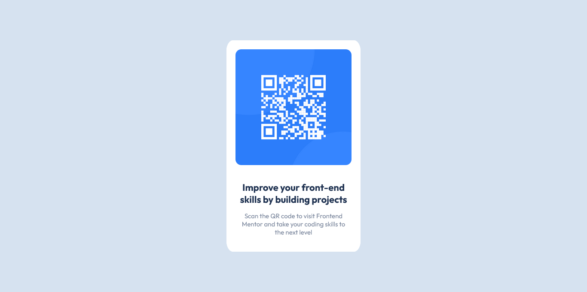
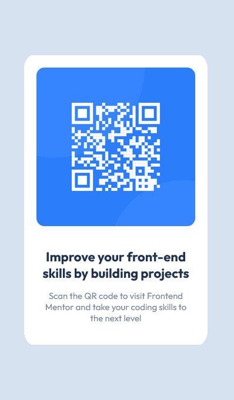

# Frontend Mentor - QR code component solution

This is a solution to the [QR code component challenge on Frontend Mentor](https://www.frontendmentor.io/challenges/qr-code-component-iux_sIO_H). Frontend Mentor challenges help you improve your coding skills by building realistic projects. 

## Table of contents

- [Overview](#overview)
  - [Screenshot](#screenshot)
- [My process](#my-process)
  - [Built with](#built-with)
  - [What I learned](#what-i-learned)
  - [Useful resources](#useful-resources)
- [Author](#author)

## Overview

### Screenshot

    

        
        windows screenshot1
    

    

        
        mobile screenshot
    

## My process

### Built with

- Semantic HTML5 markup
- CSS custom properties
- Flexbox
- Mobile-first workflow

### What I learned

I was struggling to center my container. I learned to do that using flexbox. I also learned to link
external fonts in HTML.

### Useful resources

- [OpenAI](https://www.openai.com) - This helped me with css with positioning container flexbox basics. I really liked using OpenAI. It provided answer quickly and it had alternative for every code. So I was able to chose the easy one and the one I understood due lack of my css knowledge.
- [Codepen](https://www.codepen.io) - This is an amazing website which helped me practice and test different ideas. With this website I don't have to worry about HTML templates. I can start by only writing necessary tags without worrying about standart HTML layout. That's really helpful for quick testing. I'd recommend it to anyone still learning HTML, CSS and JS.

## Author

- Frontend Mentor - [@booirng](https://www.frontendmentor.io/profile/boooring)

